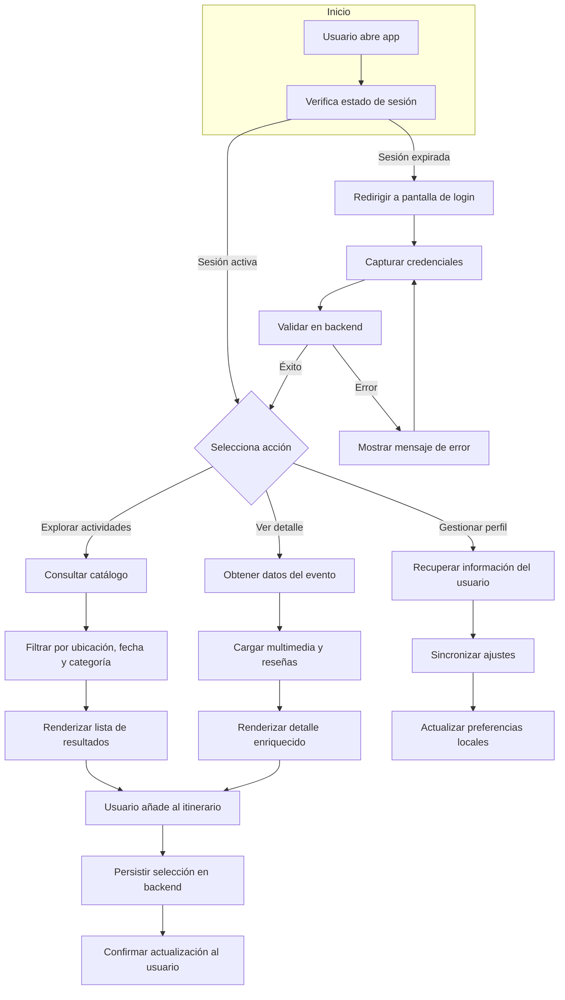

# Diagrama de flujo del sistema

- **Entradas principales:** credenciales del usuario, parámetros de filtrado, identificadores de eventos.
- **Salidas clave:** listas filtradas, pantallas de detalle, confirmaciones de itinerario.
- **Lógica destacada:** validación de sesión, sincronización de preferencias y persistencia de itinerario.
